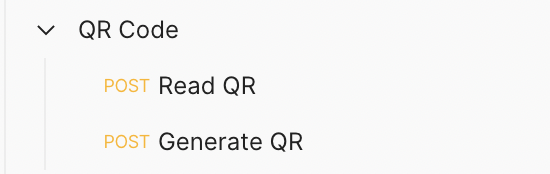

# QR Application

This is a basic QR Code application.
Using this application you can generate QR code for your text/links.
Using this application you can read (decode) QR codes.


## 🔗 Content

* [Overview](#qr-application)
* [Content](#🔗-content)
* [Features](#📋-features)
* [Tech Stack](#🧰-tech-stack)
* [API Reference](#🛠-api-reference)
* [Run Locally](#💻-run-locally)
* [Documentation](#📄-documentation)
* [Demo](#🧑🏻‍💻-demo)
* [Screen-Shots](#🌄-screen-shots)
* [Author](#🙋🏻‍♂️-author)


## 📋 Features

- QR codes generated are universally accepted.
- Generate QR codes for text and links.
- Read/Decode QR codes.


## 🧰 Tech Stack

**Backebd:** Django, Django REST Framework *(Python)*

**Frontend:** HTML, CSS, Javascript


## 🛠 API Reference

**Postman Endpoints** : https://www.getpostman.com/collections/cd81994f26e4f66094be



**API Endpoints JSON file** (for importing into thunderclient/postman) is available in the docs folder or click [here](docs/endpoints.json) 


## 💻 Run Locally

***Step#1 : Clone Project Repository***

```bash
git clone https://github.com/atharvparkhe/qr-application.git && cd qr-application
```

***Step#2 : Create Virtual Environment***

* If *virtualenv* is not istalled :
  ```bash
    pip install virtualenv
  ```
* **In Windows :**
  ```bash
    virtualenv env && env/Scripts/activate
  ```
* **In Linux or MacOS :**
  ```bash
    virtualenv env && source env/bin/activate
  ```

***Step#3 : Install Dependencies***

```bash
  pip install -r requirements.txt
```

***Step#4 : Run Server***

```bash
  python manage.py runserver
```
- *Open the "Templates" folder and then open "mainPage.html"*

- *Check the terminal if any error.*


## 📄 Documentation

The docs folder contain all the project documentations and screenshots of the project.


## 🧑🏻‍💻 Demo


YouTube Link : https://youtu.be/XUz8AXPYfP8


## 🌄 Screen-Shots


## 🙋🏻‍♂️ Author

**🤝 Connect with Atharva Parkhe**

[](https://www.linkedin.com/in/atharva-parkhe-3283b2202/)
[](https://www.github.com/atharvparkhe/)
[](https://www.twitter.com/atharvparkhe/)
[](https://www.instagram.com/atharvparkhe/)
[](https://leetcode.com/patharv777/)
[](https://www.youtube.com/channel/UChimOJO64hOqtE7HCgtiIig)
[](https://discord.gg/8WNC43Xsfc)
